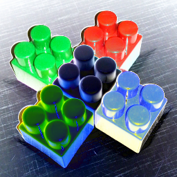

## Работа 3. Яркостные преобразования изображений
автор: Дворядкин К.А.
дата: 2022-02-26T23:30:19

url: [https://github.com/DiorChoppa/imageprocessing-spring-2022/tree/main/prj.labs/lab03](https://github.com/DiorChoppa/imageprocessing-spring-2022/tree/main/prj.labs/lab03)

### Задание
1. В качестве тестового использовать изображение data/cross_0256x0256.png
2. Сгенерировать нетривиальную новую функцию преобразования яркости (не стоит использовать линейную функцию, гамму, случайная).
3. Сгенерировать визуализацию функцию преобразования яркости в виде изображения размером 512x512, черные точки а белом фоне.
4. Преобразовать пиксели grayscale версии тестового изображения при помощи LUT для сгенерированной функции преобразования.
4. Преобразовать пиксели каждого канала тестового изображения при помощи LUT для сгенерированной функции преобразования.
5. Результы сохранить для вставки в отчет.

### Результаты


<br/>Рис. 1. Исходное тестовое изображение


<br/>Рис. 2. Тестовое изображение greyscale


<br/>Рис. 3. Результат применения функции преобразования яркости для greyscale


<br/>Рис. 4. Результат применения функции преобразования яркости для каналов


<br/>Рис. 5. Визуализация функции яркостного преобразования

### Текст программы

```cpp
#include <opencv2/opencv.hpp>
#include <cmath>

// 2. Сгенерировать нетривиальную новую функцию преобразования яркости (не стоит использовать линейную функцию, гамму, случайная).

double ft_brchange(int pixel){
	return pow(pixel, sin(pixel));
}

int main() {

	// 1. В качестве тестового использовать изображение data/cross_0256x0256.png

	std::string path_img = cv::samples::findFile("../../data/lab03_rgb.png");
	cv::Mat img = cv::imread(path_img);

	if (img.empty()) {
		std::cout << "Could not read image!";
		return EXIT_FAILURE;
	}

	cv::imwrite("lab03_rgb.png", img);


	// 3. Сгенерировать визуализацию функцию преобразования яркости в виде изображения размером 512x512, черные точки а белом фоне.

	cv::Mat lut(1, 256, CV_8UC1);
	for(int i = 0; i < 256; i++){
		lut.at<uchar>(0, i) = ft_brchange(i);
	}
	
	cv::Mat clear(512, 512, CV_8UC1, 255);
	for(int i = 0; i < 512; i++){
		clear.at<uchar>(512 - 2*lut.at<uchar>(0, i/2) - 1, i) = 0;
	}
	cv::imwrite("lab03_viz_func.png", clear);


	// 4. Преобразовать пиксели grayscale версии тестового изображения при помощи LUT для сгенерированной функции преобразования.
	// 5. Преобразовать пиксели каждого канала тестового изображения при помощи LUT для сгенерированной функции преобразования.

	cv::Mat grayscale;
	cv::cvtColor(img, grayscale, cv::COLOR_BGR2GRAY);
	cv::imwrite("lab03_gre.png", grayscale);

	cv::Mat res_img, res_gray;
	cv::LUT(img, lut, res_img);
	cv::LUT(grayscale, lut, res_gray);

	cv::imwrite("lab03_gre_res.png", res_gray);
	cv::imwrite("lab03_rgb_res.png", res_img);
	
	return 0;
}

```
